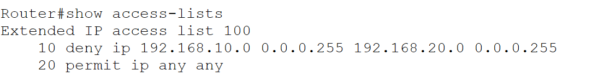
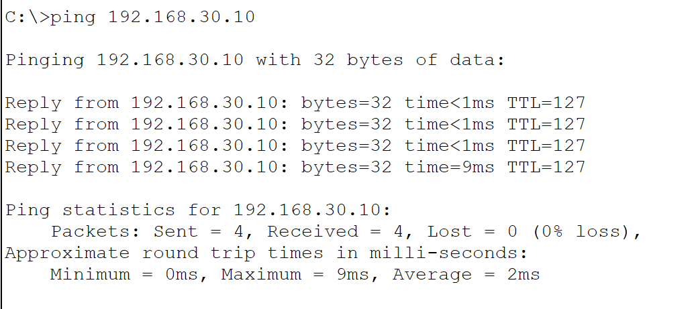
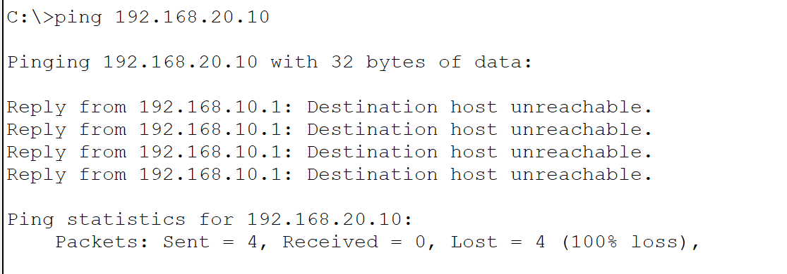

# acl-network-security
Implemented standard and extended ACLs in Cisco Packet Tracer to control network traffic and enhance network security.
# ACL Network Security

## Project Overview

Designed and implemented Access Control Lists (ACLs) in Cisco Packet Tracer to restrict unauthorized network access and improve security.

## Technologies Used

- Cisco Packet Tracer
- Standard ACL
- Extended ACL
- Routing
- Network Security

## Features

- Configured ACL rules
- Restricted access between networks
- Allowed authorized traffic
- Verified ACL functionality using ping tests

## Tools

- Cisco Packet Tracer

## Outcome

Successfully implemented ACL-based traffic filtering and validated secure communication.

## Screenshots

### Network Topology

### ACL Configuration

### Running Configuration

### Allowed Traffic Test

### Blocked Traffic Test

